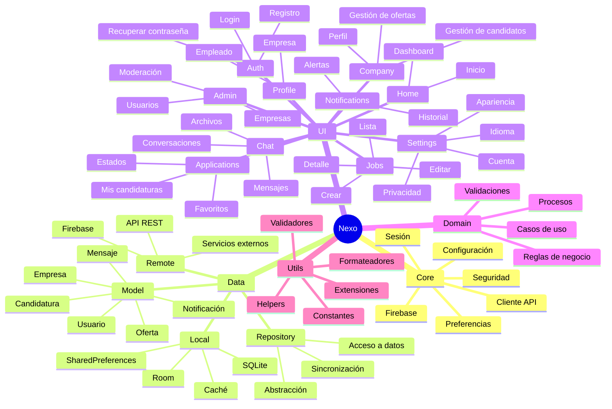
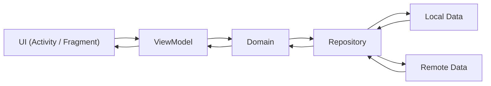

# Arquitectura del proyecto Nexo

## Descripción general

La arquitectura de la aplicación está basada en:

- **MVVM (Model - View - ViewModel)** como patrón principal de presentación.
- **Clean Architecture** para separar responsabilidades y mantener un código escalable.
- **Repository Pattern** para abstraer el acceso a datos.
- **Organización modular por funcionalidades (Feature-based Architecture)** para dividir la aplicación según sus características principales.

La estructura principal del proyecto se divide en:

- **UI** → Capa de presentación.
- **Domain** → Capa de negocio.
- **Data** → Capa de datos.
- **Core** → Capa de infraestructura y servicios generales.
- **Utils** → Herramientas auxiliares reutilizables.

---

# UI (Capa de presentación)

La capa **UI** es la encargada de mostrar la información al usuario y gestionar la interacción con la aplicación.

No contiene lógica de negocio, sino que se comunica con el **ViewModel**, que administra los datos necesarios para la interfaz.

## Contiene:

### Activities

Son los componentes principales de una aplicación Android.

Se encargan de gestionar una pantalla completa y controlar el ciclo de vida de la interfaz.

Ejemplo:

```
LoginActivity
HomeActivity
ProfileActivity
```

---

### Fragments

Son componentes reutilizables dentro de un Activity.

Permiten dividir una pantalla en diferentes secciones y facilitar la navegación.

Ejemplo:

```
JobFragment
ProfileFragment
ChatFragment
```

---

### Adapters

Funcionan como puente entre los datos y los componentes visuales.

Principalmente utilizados para mostrar listas mediante componentes como RecyclerView.

Ejemplo:

```
JobAdapter
MessageAdapter
CandidateAdapter
```

Su función es transformar los datos recibidos en elementos visuales.

---

### ViewModel

Es el encargado de administrar los datos de la interfaz.

Se comunica con la capa Domain mediante casos de uso y mantiene la información durante cambios de configuración, como rotaciones de pantalla.

Ejemplo:

```
LoginViewModel
JobViewModel
ProfileViewModel
```

---

### Estados de pantalla

Representan la información actual de una interfaz en un momento determinado.

Permiten controlar diferentes situaciones de la aplicación.

Ejemplos:

```
Loading
Success
Error
Empty
```

Ejemplo:

Una pantalla de candidaturas puede estar:

- Cargando datos.
- Mostrando candidaturas.
- Sin candidaturas disponibles.
- Mostrando un error de conexión.

---

# Domain (Capa de negocio)

Es la capa donde se encuentran las reglas principales de la aplicación.

No depende de Android ni de la interfaz gráfica.

Su objetivo es definir cómo funciona el sistema independientemente de cómo se muestre.

## Contiene:

---

## Casos de uso (Use Cases)

Representan acciones concretas que puede realizar el usuario o el sistema.

Son los encargados de coordinar la lógica necesaria para completar una operación.

Ejemplos:

```
LoginUserUseCase
CreateJobUseCase
ApplyJobUseCase
UpdateProfileUseCase
```

Ejemplo:

El caso de uso de iniciar sesión:

- Recibe las credenciales.
- Comprueba los datos.
- Solicita la información al repositorio.
- Devuelve el resultado.

---

## Reglas de negocio

Contienen las condiciones y procesos que debe cumplir el sistema.

Son independientes de la interfaz y de la fuente de datos.

Ejemplos:

- Un usuario no puede enviar dos veces la misma candidatura.
- Una empresa no puede publicar una oferta sin información obligatoria.
- Una oferta cerrada no puede recibir nuevas solicitudes.

---

## Entidades

Representan los conceptos principales del sistema.

Son objetos que contienen información importante del negocio.

Ejemplos:

```
User
Company
Job
Application
Message
Notification
```

No dependen de cómo se guarden los datos en la base de datos.

---

# Data (Capa de datos)

La capa **Data** se encarga de obtener, almacenar y gestionar la información de la aplicación.

Es la encargada de decidir de dónde obtener los datos:

- Base de datos local.
- Servidor remoto.
- Servicios externos.
- Caché.

## Contiene:

---

## Local

Gestiona los datos almacenados dentro del dispositivo.

Ejemplos:

```
Room
SQLite
SharedPreferences
Cache
```

Uso:

- Guardar información offline.
- Mantener sesiones.
- Almacenar configuraciones.

---

## Remote

Gestiona la comunicación con servicios externos.

Ejemplos:

```
API REST
Firebase
Servicios externos
```

Uso:

- Obtener ofertas.
- Registrar usuarios.
- Enviar mensajes.

---

## Repository

Es el intermediario entre Domain y Data.

Oculta la complejidad de obtener los datos.

La capa superior no sabe si los datos vienen de una API o de una base de datos local.

Ejemplo:

```
ViewModel
    ↓
UseCase
    ↓
Repository
    ↓
Local / Remote
```

Funciones:

- Obtener información.
- Guardar datos.
- Sincronizar información.
- Gestionar diferentes fuentes de datos.

---

## Model

Representa los modelos utilizados para transportar información entre capas.

Ejemplos:

```
UserModel
JobModel
ApplicationModel
MessageModel
```

Normalmente representan la estructura de los datos recibidos desde una API o base de datos.

---

# Core (Capa de infraestructura)

La capa **Core** contiene servicios generales y componentes fundamentales que necesita toda la aplicación.

No pertenece a una funcionalidad concreta, sino que proporciona herramientas e infraestructura común.

## Contiene:

---

## Configuración

Gestiona configuraciones generales de la aplicación.

Ejemplos:

- Variables globales.
- Configuración del entorno.
- Parámetros de la aplicación.

---

## Sesión

Gestiona la información del usuario actualmente conectado.

Ejemplos:

- Usuario activo.
- Token de autenticación.
- Estado de sesión.

---

## Seguridad

Contiene elementos relacionados con la protección de datos.

Ejemplos:

- Encriptación.
- Gestión segura de credenciales.
- Protección de información sensible.

---

## Preferencias

Gestiona configuraciones almacenadas del usuario.

Ejemplos:

- Tema de la aplicación.
- Idioma.
- Preferencias personales.

Tecnologías:

```
SharedPreferences
DataStore
```

---

## Cliente API

Configura la comunicación con servidores externos.

Ejemplos:

- Retrofit.
- OkHttp.
- Interceptores.
- Gestión de peticiones HTTP.

---

## Firebase

Contiene la configuración y servicios relacionados con Firebase.

Ejemplos:

- Firebase Authentication.
- Firestore.
- Cloud Messaging.
- Notificaciones push.

---

# Utils (Herramientas auxiliares)

Contiene clases y funciones reutilizables que facilitan el desarrollo.

No contienen lógica de negocio.

## Contiene:

---

## Validadores

Comprueban que los datos sean correctos.

Ejemplos:

- Validación de correo.
- Comprobación de contraseñas.
- Validación de formularios.

---

## Helpers

Funciones auxiliares utilizadas en diferentes partes de la aplicación.

Ejemplos:

- Conversión de datos.
- Funciones comunes.
- Métodos reutilizables.

---

## Formateadores

Transforman información a formatos específicos.

Ejemplos:

- Fechas.
- Horas.
- Texto.
- Monedas.

---

## Constantes

Contiene valores fijos utilizados por la aplicación.

Ejemplos:

```
URLs
Códigos
Configuraciones globales
```

---

## Extensiones

Métodos adicionales para ampliar funcionalidades existentes.

Ejemplo:

Añadir funciones propias a clases de Android o Java.

---
# Arquitectura esquema
---


# Comunicación entre packetes
---

Esta separación permite:

- Mayor mantenimiento del código.
- Facilidad para realizar pruebas.
- Escalabilidad del proyecto.
- Separación clara de responsabilidades.
- Facilidad para añadir nuevas funcionalidades.